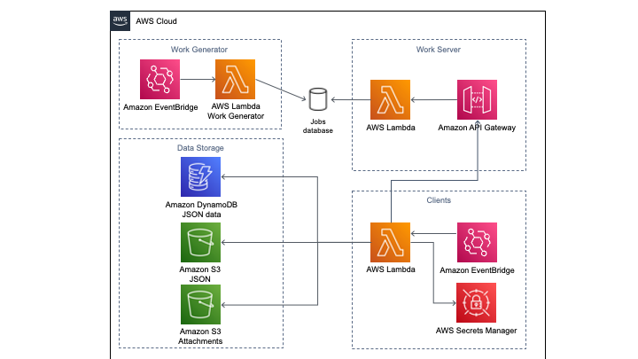

## Draft Architecture

### Work Generator

* EventBridge triggers the work generator function - once per day is sufficient until we get caught up; then once per hour or faster

### Jobs Database

* TBD: What type of database is best here?
* Initially we will have a large collection of Jobs
* Need to add single job and remove single job from collection

### Client

* Each Client is triggered by EventBridge
* 1/1000 hour / call * 60 minutes / hour * 60 seconds / minute = 3.6 seconds per call.  Thus, if we sleep 3.6 seconds between calls, we will never make more than 1000 calls per hour
* In this design, the client writes data directly to data storage.  It does **NOT** return data to the work server.
* We store API keys in SecretsManager
* TBD: We need a mechanism to scale to $n$ clients.  CloudFormation?
* Each client should just *know* its client ID - don't make a call to the work server to obtain one

### Work Server

* Since the client does not return work, the only end point we need is `get_job`
* This endpoint should still require a client IDs.  This will allow the work server to log which client did each job.

### Data Storage

* The JSON data should be stored in an S3 bucket as well as in a NoSQL DB (the diagram shows DynamoDB, but this is up for discussion).
* Attachments should be stored in a separate bucket so we can process them more easily.  We will work to download them and then we will extract the text later. 
* We may need another bucket for the text extracted from attachments and for the JSON records that tie together all the data for a particular comment.